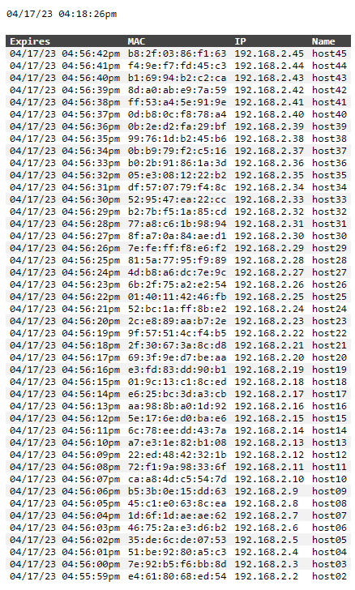

<!-- https://github.com/tbblake/myScripts/tree/main/dhcpPihole -->
# dhcpPihole
This displays your pihole dhcp lease table in an easy to read format.  A lighttpd configuration is included to restrict what gets logged, to reduce SD card wear & tear.  Only tested on a vanilla pihole install on a vanilla raspbian install on a raspberry pi 3b+.

Additional options can be passed to the php script in the URL for html, text / json / csv, date output, and sorting options:

* sortOrder
  * 0 - ascending
  * 1 - descending
* sortField
  * 1 - mac address
  * 3 - name
  * 4 - expiration
  * 5 - ip
* fmt
  * 0 - html
  * 1 - text
  * 2 - json
  * 3 - csv
* noDate - supresses date in output

* htmlTable - output html table (deprecated, use fmt flag)
* textTable - output text table (deprecated, use fmt flag)
* jsonTable - output json table (deprecated, use fmt flag)

To install, copy dhcpLeases.php to /var/www/html, 10-accesslog-dhcpLeases.conf to /etc/lighttpd/conf-enabled, then restart lighttpd.

Or this:

```
git clone https://github.com/tbblake/myScripts.git
sudo cp myScripts/dhcpPihole/dhcpLeases.php /var/www/html/dhcpLeases.php
sudo cp myScripts/dhcpPihole/10-accesslog-dhcpLeases.conf /etc/lighttpd/conf-enabled/10-accesslog-dhcpLeases.conf
sudo chmod 644 /var/www/html/dhcpLeases.php /etc/lighttpd/conf-enabled/10-accesslog-dhcpLeases.conf
sudo systemctl restart lighttpd
```

Or this:

```
sudo curl -sLo /var/www/html/dhcpLeases.php https://raw.githubusercontent.com/tbblake/myScripts/main/dhcpPihole/dhcpLeases.php
sudo curl -sLo /etc/lighttpd/conf-enabled/10-accesslog-dhcpLeases.conf https://raw.githubusercontent.com/tbblake/myScripts/main/dhcpPihole/10-accesslog-dhcpLeases.conf
sudo chmod 644 /var/www/html/dhcpLeases.php /etc/lighttpd/conf-enabled/10-accesslog-dhcpLeases.conf
sudo systemctl restart lighttpd
```

Then browse to the script http://your.pihole.ip.here/dhcpLeases.php

Browser example:


